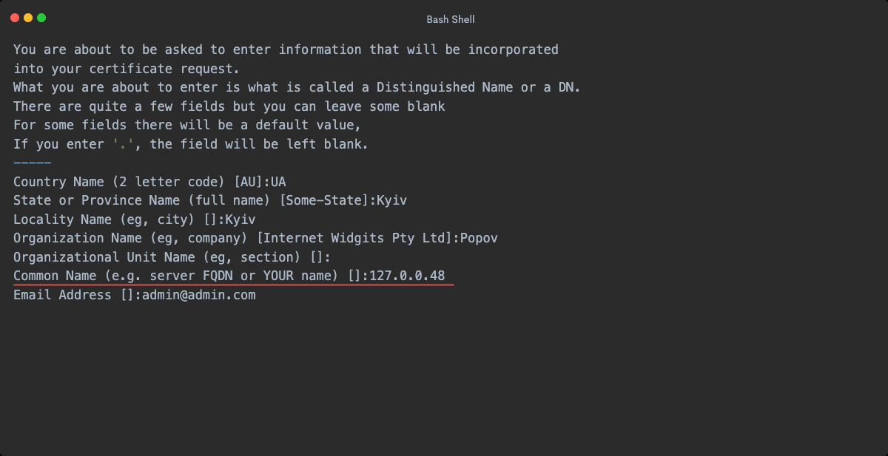

# Docker Development Environment

<p align="center">

<a href="https://app.codacy.com/gh/OleksiiPopovDev/Docker-Development-Environment/dashboard?utm_source=gh&utm_medium=referral&utm_content=&utm_campaign=Badge_grade"></a>


</p>

## How use it

1. Add to your repository directory **docker** with two files:

   _Replace all points like {USER_NAME} into your configs_

| Point           | Description                               |
|-----------------|-------------------------------------------|
| {USER_NAME}     | User name of your local database          |
| {PASSWORD}      | Password for connection to local database |
| {DATABASE_NAME} | Database name                             |
| {LOCAL_DOMAIN}  | Domain of your local project              |
| {PROJECT_NAME}  | Project name                              |

2. database.db

```sql
    CREATE USER IF NOT EXISTS  '{USER_NAME}'@'%' IDENTIFIED BY '{PASSWORD}';
    
    CREATE DATABASE IF NOT EXISTS {DATABASE_NAME};
    
    GRANT ALL PRIVILEGES ON {DATABASE_NAME}.* TO '{USER_NAME}'@'%';
    
    FLUSH PRIVILEGES;
   ```

3. nginx.conf

```apacheconf
server {
    listen       80;
    listen       443 ssl;
    
    server_name  {LOCAL_DOMAIN};
    
    ssl_certificate /etc/ssl/{PROJECT_NAME}.crt;
    ssl_certificate_key /etc/ssl/{PROJECT_NAME}.key;
    
    charset utf-8;
    
    access_log  /var/log/nginx/{PROJECT_NAME}.access.log  main;
    error_log /var/log/nginx/{PROJECT_NAME}.error.log;
    
    root   /var/www/{PROJECT_FOLDER}/public;
    
    index  index.php index.html index.htm;
    
    error_page   500 502 503 504  /50x.html;
    
    location = /50x.html {
        root   /usr/share/nginx/html;
    }
    
    location / {
        try_files $uri $uri/ /index.php?$query_string;
    }
    
    location ~ \.php$ {
        try_files $uri =404;
        fastcgi_pass   php:9000;
        fastcgi_index  index.php;
        fastcgi_param  SCRIPT_FILENAME  $document_root$fastcgi_script_name;
        include        fastcgi_params;
    }
    
    location ~ /\.ht {
        deny  all;
    }
}
```

4. Generate Certificate for use SSL (_optional_)

In project folder run this commands:

   ```shell
   cd docker
   ```

   ```shell
   /usr/local/opt/openssl/bin/openssl req -x509 -nodes -days 825 -newkey rsa:2048 \
      -addext "subjectAltName = IP:127.0.0.48,DNS:{LOCAL_DOMAIN}" \
      -addext "extendedKeyUsage = serverAuth" \
      -keyout private.key \
      -out certificate.crt
   ```

_Replace {LOCAL_DOMAIN} to your local project domain from nginx.conf_

Fill all fields:

The most important line is the one that requests the Common Name (e.g. server FQDN or YOUR name). You need to enter the
domain name associated with your server or your server’s public IP address (in my case it is just a testing setup - so I
will use my local IP address).

2. <span style="color:orange">If you are use MacOS!</span>

    1. Copy content bellow into **/Library/LaunchDaemons/com.docker_1270048_alias.plist**

    ```xml
    <?xml version="1.0" encoding="UTF-8"?>
    <!DOCTYPE plist PUBLIC "-//Apple//DTD PLIST 1.0//EN" "http://www.apple.com/DTDs/PropertyList-1.0.dtd">
    <plist version="1.0">
    <dict>
        <key>Label</key>
        <string>com.docker_1270048_alias</string>
        <key>ProgramArguments</key>
        <array>
            <string>ifconfig</string>
            <string>lo0</string>
            <string>alias</string>
            <string>127.0.0.48</string>
        </array>
        <key>RunAtLoad</key>
        <true/>
    </dict>
    </plist>
    ```
    2. Run command: `sudo launchctl load /Library/LaunchDaemons/com.docker_1270048_alias.plist`


3. Add to **/etc/hosts** local domain of your project
   `127.0.0.48 {LOCAL_DOMAIN}`
4. Add your repository to **.repositories** file.
5. Run installation command `make install`.
6. Follow step-by-step installation

---

## Commands of Makefile

| Command          | Description                                                                    |
|------------------|--------------------------------------------------------------------------------|
| `make install`   | Installation new project to Container                                          |
| `make uninstall` | Reinstall project from Container                                               |
| `make bash`      | Enter to Bash of Container                                                     |
| `make start`     | Start Docker Containers                                                        |
| `make stop`      | Stop Docker Containers                                                         |
| `make up`        | Build and up Containers                                                        |
| `make down`      | Remove Containers                                                              |
| `make rebuild`   | Remove, build and up Containers with refreshing database, migrations and seeds |

## Additional service's commands

| Command                      | Description                                                           |
|------------------------------|-----------------------------------------------------------------------|
| `make sentry-install`        | Install the Sentry for projects. Installation with redis and Postgres |
| `make sentry-import`         | Import a projects to Sentry                                           |
| `make sentry-uninstall`      | Yahh! This is uninstalling the Sentry                                 |
| `make grafana-install`       | Installation Grafana with default credentials                         |
| `make grafana-uninstall`     | Uninstall the Grafana                                                 |
